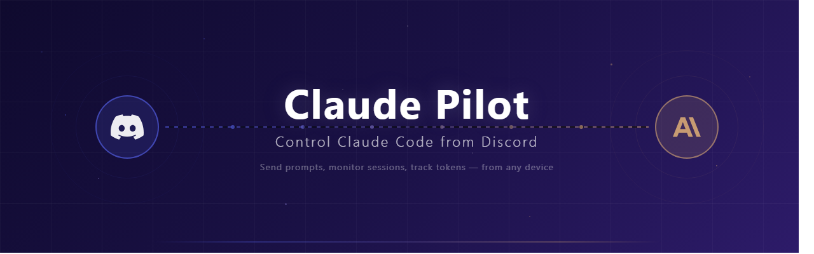

<div align="center">



<br/>

### Run Claude Code from Discord — anywhere, anytime.

[](https://discord.js.org/)
[](https://nodejs.org/)
[](https://git-scm.com/download/win)
[](#license)
[](#policy-compliance)

<br/>

**Claude Pilot** turns your Discord server into a remote control for [Claude Code](https://docs.anthropic.com/en/docs/claude-code).
Send prompts, monitor sessions, track token usage, and manage projects — all from your phone or any device with Discord.

No browser tabs. No SSH tunnels. No terminal babysitting. Just type a slash command and go.

<br/>

> **Platform:** Windows only (Git Bash required). The session tracking component relies on Windows-specific process detection (`tasklist`, `claude.exe`) and has not been ported to macOS or Linux.

> **Disclaimer:** Not fully tested. Use at your own risk. Review the code before running it in a critical environment.

</div>

---

## Background

This project was built before Anthropic released [Remote Control](https://docs.anthropic.com/en/docs/claude-code/remote) for Claude Code. Now that official remote access exists, Claude Pilot is being open-sourced for anyone who might find the Discord-based approach useful.

**What Claude Pilot does differently:**

- Runs Claude Code sessions through **Discord slash commands** — no browser or terminal needed on the remote side
- **Multiple users** in a Discord server can see session progress in real time
- Sessions are **persistent** — they survive bot restarts and support `--resume`
- Built-in **token usage tracking**, dashboards, and reports
- Supports starting **new sessions remotely** via `/send`

It's not a replacement for Remote Control — just a different approach that happened to exist first.

---

## Policy Compliance

**Claude Pilot does not intercept, forge, or reuse OAuth tokens.**

Some third-party tools have been banned for capturing Claude subscription OAuth credentials and routing API requests through them — effectively bypassing Anthropic's rate limits and billing controls. This violates [Anthropic's Terms of Service](https://www.anthropic.com/policies/consumer-terms).

Claude Pilot works differently:

- It spawns the **official `claude` CLI** as a subprocess — the same binary you run in your terminal
- Authentication is handled entirely by Claude Code itself — Claude Pilot never touches your credentials
- All rate limiting, telemetry, and usage enforcement remain under Anthropic's control
- It's functionally identical to you typing commands in a terminal, just triggered from Discord

**There is no token interception, no credential forwarding, and no API bypass.** Claude Pilot is a remote interface to the official tool, not a replacement for it.

---

## Features

- **`/send`** — Send prompts to Claude, with optional project, model, file, and image attachments
- **Streaming responses** — Watch Claude's output appear in real time in Discord
- **Persistent sessions** — Sessions survive bot restarts and support `--resume`
- **`/project`** — Set per-channel default working directories
- **`/model`** — Switch models mid-session (Opus, Sonnet, Haiku)
- **`/compact`** — Compress conversation context when it gets large
- **`/status`** — See all running Claude processes with live token counts
- **`/dashboard`** — Auto-refreshing embed showing session health
- **`/report`** — Token usage reports by day, week, or all time
- **`/sessions`** — Save, list, and reload previous sessions
- **GPT/Codex integration** — Optional `/gpt` command for OpenAI Codex sessions

---

## How It Works

```
┌─────────────┐     hooks      ┌──────────────────┐    state.json    ┌─────────────┐
│ Claude Code  │ ──────────────▶│  claude-tracker   │ ───────────────▶│             │
│   (local)    │   SessionStart │   (bash script)   │   live session  │  Discord    │
│              │   Stop, End    │                    │   data          │  Bot        │
└─────────────┘                └──────────────────┘                  │  (bot.js)   │
                                                                      │             │
┌─────────────┐                                                      │             │
│  Discord     │◀──── slash commands, streaming responses ───────────│             │
│  (any device)│────▶ /send, /status, /model, /compact ─────────────▶│             │
└─────────────┘                                                      └─────────────┘
```

**Two components:**

1. **`claude-tracker`** — A bash script installed as Claude Code hooks. It captures `SessionStart`, `UserPromptSubmit`, `Stop`, and `SessionEnd` events, writing live session state to `~/.claude-tracker/state.json`.

2. **Discord bot** (`bot.js`) — Reads tracker state, spawns Claude CLI processes on demand, streams responses to Discord, and exposes everything as slash commands.

---

## Quick Start

### Prerequisites

- **Windows** with [Git for Windows](https://git-scm.com/download/win) (Git Bash)
- [Claude Code CLI](https://docs.anthropic.com/en/docs/claude-code) installed and authenticated
- [Node.js](https://nodejs.org/) 18+
- [jq](https://jqlang.github.io/jq/) — `winget install jqlang.jq` or `scoop install jq`

### 1. Create a Discord Bot

1. Go to [Discord Developer Portal](https://discord.com/developers/applications)
2. **New Application** → **Bot** tab
3. Enable **Message Content Intent** under Privileged Gateway Intents
4. **Reset Token** → copy it
5. Invite via **OAuth2 > URL Generator**:
   - Scopes: `bot`, `applications.commands`
   - Permissions: `Send Messages`, `Read Message History`, `Create Public Threads`, `Manage Threads`, `Embed Links`, `Add Reactions`, `Attach Files`

### 2. Install

```bash
git clone https://github.com/criel2019/claude-pilot.git
cd claude-pilot
./install.sh
npm install
```

The installer checks dependencies, copies the tracker script, registers Claude Code hooks, and prompts for your Discord bot token.

> **Restart Claude Code after install** so the hooks take effect.

### 3. Run

```bash
node bot.js
```

Or double-click `start-bot.vbs` to run in the background (no terminal window).

Slash commands register automatically on first run.

---

## Commands

### Claude Sessions

| Command | Description |
|---------|-------------|
| `/send [message] [project] [model] [file] [image]` | Send a prompt to Claude. Creates or continues a session. |
| `/end` | End the current session in this channel |
| `/session` | Show session info (model, turns, context, tokens) |
| `/sessions` | List saved sessions and reload one |
| `/project` | Set the default project for this channel |
| `/compact` | Compress conversation context |
| `/model <model>` | Switch model mid-session |

### Monitoring

| Command | Description |
|---------|-------------|
| `/status` | All running Claude processes with token counts |
| `/dashboard` | Live-updating dashboard embed |
| `/snapshot` | Record a token usage snapshot |
| `/report [period]` | Usage report — `today`, `week`, or `all` |

### GPT / Codex _(optional)_

| Command | Description |
|---------|-------------|
| `/gpt <message> [project] [model]` | Start an OpenAI Codex session |
| `/gpt-project` | List registered GPT projects |

Requires `codex` CLI and OpenAI API key. No effect on Claude features if unused.

---

## Configuration

`~/.claude-tracker/config.json` — created by `install.sh`:

| Key | Default | Description |
|-----|---------|-------------|
| `bot_token` | — | Discord bot token (required) |
| `default_cwd` | `$HOME` | Default working directory for sessions |
| `allowed_users` | `[]` | Discord user IDs allowed to use commands (empty = all) |
| `session_timeout_minutes` | `60` | Idle session auto-cleanup threshold |
| `stream_edit_interval_ms` | `2000` | Streaming response edit frequency |
| `max_context_history_turns` | `4` | History turns included per request |
| `max_context_chars` | `50000` | Max context history size |

---

## Updating

```bash
git pull
```

Then restart the bot. Re-run `install.sh` only if hooks or config format changed.

> Use `git clone` to install — not the zip download — so you can pull updates.

---

## Persistent Sessions

Sessions survive bot restarts. On startup, the bot reloads all active sessions from `~/.claude-tracker/bot-sessions/` and reconnects to their Discord threads.

Sessions with a Claude session ID support `--resume`, preserving full conversation context across restarts.

Ended sessions are kept for 10 days, then automatically purged along with their Discord thread messages.

---

## File Structure

```
install.sh                  Installer (Git Bash)
claude-tracker.sh           Hook script (→ ~/.claude-tracker/bin/)
bot.js                      Discord bot entry point
start-bot.vbs               Background launcher (no terminal)
config.example.json         Config reference

src/
  config.js                 Config loader (TTL cache + hot-reload)
  constants.js              Paths, limits, colors
  state.js                  In-memory state
  session.js                Session CRUD, history, tokens, queue
  claude.js                 CLI spawn, streaming, turn runner
  tracker.js                Hook integration + process scan
  dashboard.js              /status, /report, /dashboard
  embeds.js                 Discord embed builders
  files.js                  File/image handling
  commands.js               Slash command definitions
  timers.js                 Periodic timers
  handlers/
    interactions.js         Command dispatcher
    send.js                 /send handler
    sessions.js             /end, /session, /sessions
    project.js              /project handler
    message.js              Follow-up message handler
    buttons.js              Button interactions
    modals.js               Modal submissions
    gpt.js                  /gpt handlers
```

---

## Security

> **The bot runs Claude with `--dangerously-skip-permissions`**, giving Claude full read/write access to your machine.

- By default (`allowed_users: []`), anyone in your Discord server can send commands
- Set `allowed_users` to trusted Discord user IDs, or keep the bot in a **private server**
- The bot never exposes or transmits your Claude credentials

---

## Dependencies

- [`discord.js`](https://discord.js.org/) ^14 — Discord API
- `claude` CLI — Claude Code (must be in PATH)
- `bash 4+`, `jq`, `curl` — required by `claude-tracker`

---

## License

MIT

---

<div align="center">

**Claude Pilot** is an independent community project and is not affiliated with or endorsed by Anthropic.

</div>
